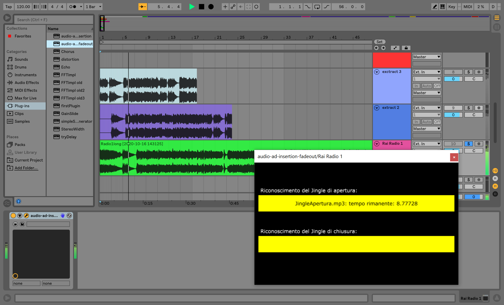
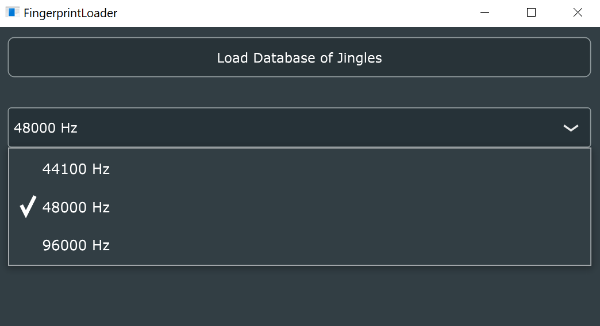
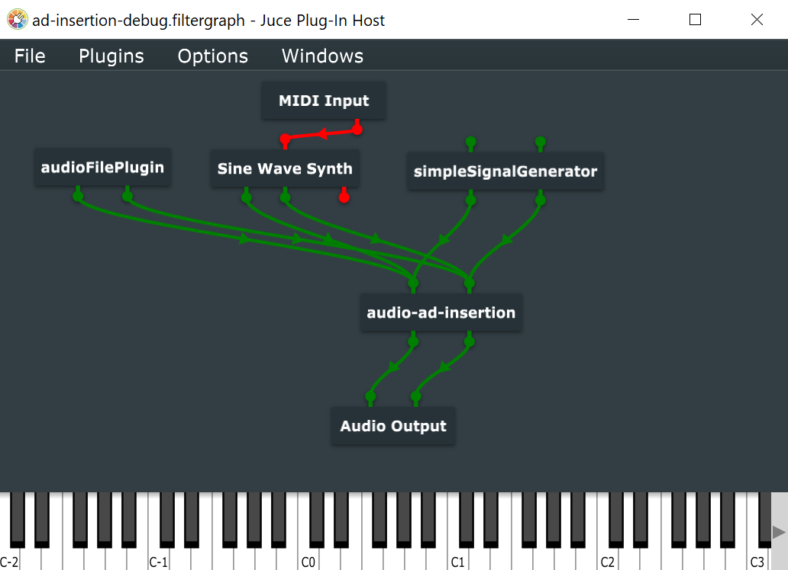

The Software uses a support directory: **audio-ad-insertion-data**, which for convenience is automatically searched by the plugin within the document directory of the machine on which it will run. The sources can be compiled after installing JUCE [1] and one of the IDEs supported for export (Xcode, Visual Studio, Code :: Blocks, Clion) with related compilers. The build process was tested with JUCE 6.0.1, Visual Studio
 Community 2017 and the "Desktop development with c ++" kit.

[1] <https://juce.com/get-juce/download>

### Offline analysis

To generate hash database, you have to:

1. create a directory **audio-ad-insertion-data/audioDatabase** containing all the jingles that will be present within the radio stream to be analyzed. Most of the common audio files formats, loseless and lossy, can be used.

2. open the **FingerprintLoader** projucer project, export it to IDE preferably among those available, and start the build process.

3. start the **FingerprintLoader** executable obtained from the build process, and from the interface, select the default sampleRate that will be used within the DAW / host will host the plugin.

4. once the hash loading operation is completed, a directory will be created within audio-ad-insertion-data dataStructures containing the json files of the data structures, which the plugin will read on startup.

    
### Running the Plugin within a DAW

To activate the process of Ad recognition and replacement:

1. open the projucer audio-ad-insertion project, from which select the plugin format you want to get (VST3, AU, AUv3, RTAS, AAX, Standalone, Unity, VST (Legacy)). Please note that for the VST (Legacy) format you need the VST SDK (tested version: vstsdk367 \ _03 \ _03 \ _2017 \ _build \ _352); and export everything to an IDE as in the previous case.

2. start the build process, and move the resulting binary to the directory used by the DAW to search for 64bit plugins.

3. create a track within the DAW on which to instantiate the plugin, and finally connect the incoming radio stream to the track. The tested DAW is Ableton Live.

The plugin in the advertising injection phase will read the audio files within the directory **audio-ad-insertion-data/audioInjection**.

### Demo

For a quick demo in Windows environment, the software already includes a FingerprintLoader.exe executable and the VST (legacy) audio-ad-insertion.dll, test jingles in **audio-ad-insertion-data/audioDatabase** with their hashes at 44100 Hz in **audio-ad-insertion-data/dataStructures**, and personalized advertisements in **audio-ad-insertion-data/audioInjection**. For convenience in **audio-ad-insertion-data/stream** have also been included sample stream sections, containing the jingles to be recognized, which can be loaded into the DAW, simulating an incoming stream, on which to apply the plugin for real-time replacement. It will be sufficient to move the **audio-ad-insertion-data** folder in documents, import the plugin into the DAW, set the same samplerate used for the hash generation (44100 HZ), load an example stream, and start playback.

# Italiano

Il Software utilizza una directory di supporto:
**audio-ad-insertion-data**, che per comodità viene ricercata
automaticamente dal plugin all’interno della directory documenti della
macchina su cui esso girerà. I sorgenti sono compilabili previa
installazione di JUCE[1] ed uno tra gli IDE supportati all’esportazione
(Xcode, Visual Studio, Code::Blocks, Clion) con relativi compilatori. La
compilazione è stata testata con JUCE 6.0.1, Visual Studio Community
2017 ed il kit "Desktop development with c++".

[1] <https://juce.com/get-juce/download>

### Analisi offline

Per la generazione del database degli hash, è necessario:

1.  creare una directory **audio-ad-insertion-data/audioDatabase**
    contenente tutti i jingle che saranno presenti all’interno dello
    stream radiofonico da analizzare. Possono essere utilizzati file
    audio dei formati più comuni loseless e lossy.

2.  aprire il progetto projucer **FingerprintLoader**, esportarlo su un
    IDE di preferenza tra quelli disponibili, ed avviare il processo di
    compilazione.

3.  avviare l’eseguibile **FingerprintLoader** ottenuto dal processo di
    compilazione, e dall’interfaccia, selezionare il sampleRate di default
    che sarà utilizzato all’interno della DAW / host che ospiterà il
    plugin.

4.  una volta completata l’operazione di caricamento degli hash,
    all’interno di audio-ad-insertion-data sarà creata una directory
    dataStructures contenente i file json delle strutture dati, che il
    plugin leggerà in fase di avvio.

    
### Esecuzione del Plugin all’interno di una DAW

Per attivare il processo di riconoscimento e sostituzione degli spot pubblicitari:

1.  aprire il progetto projucer audio-ad-insertion, dal quale
    selezionare il formato del plugin che si desidera ottenere (VST3,
    AU, AUv3, RTAS, AAX, Standalone, Unity, VST (Legacy)), tenendo
    presente che per il formato VST(Legacy) è necessario prima fornirsi
    dell’SDK VST (versione testata:
    vstsdk367\_03\_03\_2017\_build\_352); ed esportare il tutto su un
    IDE come nel caso precedente.

2.  avviare la compilazione, e spostare il binario ottenuto nella
    directory utilizzata dalla DAW per la ricerca dei plugin 64bit.

3.  creare una traccia all’interno della DAW su cui istanziare il
    plugin, ed infine collegare lo stream radiofonico in ingresso alla
    traccia tramite routing. La DAW su cui è stato eseguito il plugin è
    Ableton Live, con il formato VST(legacy).

Il plugin in fase di injection pubblicitaria, leggerà i file audio
presenti all’interno della directory
**audio-ad-insertion-data/audioInjection**.

### Demo

Per una veloce demo in ambiente Windows, nel software è già fornito un
eseguibile FingerprintLoader.exe ed il VST(legacy)
audio-ad-insertion.dll, dei jingle di test in
**audio-ad-insertion-data/audioDatabase** con i relativi hash a 44100 Hz
in **audio-ad-insertion-data/dataStructures**, e delle pubblicità
personalizzate in **audio-ad-insertion-data/audioInjection**. Per
comodità in **audio-ad-insertion-data/stream** sono state inserite anche
delle sezioni stream di esempio, contenenti i jingle da riconoscere, che
possono essere caricate all’interno della DAW, simulando uno streaming
in ingresso, su cui applicare il plugin per la sostituzione in tempo
reale. Basterà quindi spostare la cartella **audio-ad-insertion-data**
in documenti, importare il plugin nella DAW, settare in essa lo stesso
samplerate usato per la generazione degli hash (44100 HZ), caricare uno
stream di esempio, ed avviare la riproduzione.
